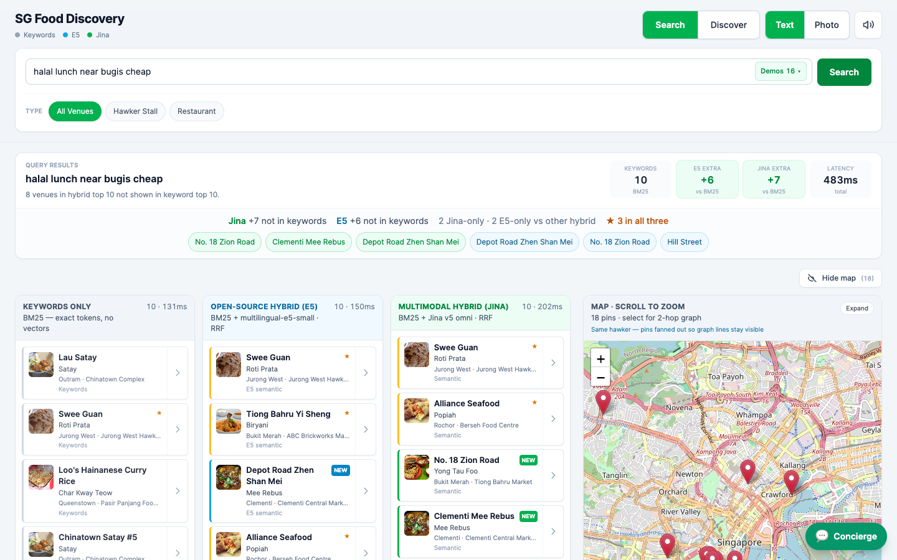

# SG Food Discovery

Singapore hawker & restaurant search demo — **Keywords (BM25) · E5 hybrid · Jina v5 omni** side-by-side, map + graph hops, photo search, and an **Agent Builder** concierge.

Built for **Elastic Cloud Serverless Search** (Jina EIS, DiskBBQ, hybrid RRF).

<p align="center">
  <a href="docs/images/readme-screenshot.png">
    
  </a>
</p>
<p align="center"><sub>Multilingual text search · hybrid recall vs keywords · synced map pins · Agent Builder concierge</sub></p>

## What you need

- **Python 3.10+**
- **Node.js 18+**
- An **existing** Elastic Cloud Search project with corpus already ingested (or use local UI-only mode without `.env`)

## Run on any laptop (UI + API only)

Uses your cloud Elasticsearch — **no re-ingest** on a new machine.

### 1. Get the code

```bash
git clone https://github.com/2gavy/sg-food-search-demo.git
cd sg-food-search-demo
```

### 2. Add credentials (not in git)

```bash
cp .env.example .env
```

Edit `.env` — minimum:

```env
ELASTICSEARCH_URL=https://your-project.es.region.aws.elastic.cloud:443
ES_API_KEY=your-api-key
LLM_CONNECTOR_ID=Anthropic-Claude-Sonnet-4-6   # for Concierge (optional)
```

`KIBANA_URL` / `KIBANA_API_KEY` default from the ES URL/key. **Never commit `.env`.**

### 3. Prep for demo (Discover tab)

```bash
chmod +x scripts/prep-demo.sh scripts/start-demo.sh
./scripts/prep-demo.sh    # clustering embeddings + warm cache (once)
```

### 4. Start

```bash
./scripts/start-demo.sh
```

Open **http://127.0.0.1:5173** — click **Discover** or **Discover food topics** on the welcome screen.

Or two terminals:

```bash
python3 -m venv .venv && source .venv/bin/activate
pip install -r requirements.txt
uvicorn api.main:app --host 127.0.0.1 --port 8000
```

```bash
cd web && npm install && npm run dev -- --host 127.0.0.1 --port 5173
```

## Deploy to Google Cloud Run

One container serves the **built React UI + FastAPI** on port `8080`. Elasticsearch stays on Elastic Cloud — set credentials as Cloud Run env vars (not `.env` in the image).

### Console deploy (no local CLI)

**→ [docs/CLOUD_RUN_CONSOLE.md](docs/CLOUD_RUN_CONSOLE.md)** — step-by-step using only the GCP Console and GitHub (connect repo, Dockerfile build, secrets, env vars).

Quick checklist:

1. Push latest code to GitHub (`main`)
2. GCP project + billing + enable Cloud Run / Cloud Build / Artifact Registry
3. Secret Manager for `ES_API_KEY` (recommended)
4. Cloud Run → **Create service** → deploy from repository → Dockerfile at repo root
5. Set `ELASTICSEARCH_URL`, `ES_API_KEY`, optional `LLM_CONNECTOR_ID`
6. Open the service URL; check `/health`

### Wizard broken? (gen1 trigger errors)

**→ [docs/CLOUD_SHELL_DEPLOY.md](docs/CLOUD_SHELL_DEPLOY.md)** — deploy from **Cloud Shell** in the browser (no local CLI, no manual triggers).

Or use **GitHub Actions**: add secrets `GCP_SA_KEY`, `GCP_PROJECT_ID`, `ELASTICSEARCH_URL`, `ES_API_KEY` → push to `main`.

### CLI deploy (optional)

Requires [Google Cloud SDK](https://cloud.google.com/sdk/docs/install):

```bash
gcloud services enable run.googleapis.com cloudbuild.googleapis.com artifactregistry.googleapis.com
export ELASTICSEARCH_URL=...
export ES_API_KEY=...
./scripts/deploy-cloudrun.sh
```

## Features

| Area | Details |
|------|---------|
| **Compare** | Three columns update together: lexical, multilingual E5, Jina omni |
| **Photo** | Upload or pick a gallery dish — Jina multimodal column |
| **Map** | Leaflet/OSM pins, 2-hop graph (`same_dish` / `same_hawker`) |
| **Concierge** | Bottom-right Agent Builder chat — sends selected venue + graph hops |
| **Discover** | Food scenes grouped from clustering embeddings — hawker centre, dish, neighbourhood |

## API (proxied by Vite in dev)

| Endpoint | Purpose |
|----------|---------|
| `POST /search/compare` | Text compare (3 columns) |
| `POST /search/compare-image` | Photo compare |
| `GET /search/graph/{doc_id}` | Graph hops for map + Concierge |
| `GET /discover/clusters` | Unsupervised food topic discovery |
| `GET /agent/status` | Agent Builder configured? |
| `POST /agent/converse` | Concierge chat |

API docs: http://127.0.0.1:8000/docs

## Agent Builder (one-time per Kibana project)

```bash
python3 scripts/setup_agent_builder.py
```

Creates the `sg-food-concierge` agent if missing. Requires `LLM_CONNECTOR_ID` in `.env`.

## Topic discovery (clustering embeddings)

Stalls are grouped into **food scenes** (e.g. *Old Airport Road · Char Kway Teow*) using Jina `task=clustering` and kNN on Serverless. Labels come from hawker centre, dish, and neighbourhood fields in the corpus.

```bash
python3 scripts/backfill_clustering_embeddings.py   # once per index
```

Open **Discover** in the app.

## Local mode (no Elasticsearch)

Omit `.env` or leave credentials empty — the API scores an in-memory corpus so you can demo the UI layout offline.

## First-time Elastic setup

Only if you are provisioning a **new** cluster (not needed when reusing an existing project):

```bash
pip install -r requirements.txt
python3 scripts/generate_synthetic_data.py
python3 scripts/setup_inference_oss.py
python3 scripts/setup_indices.py
python3 scripts/ingest_corpus.py
python3 scripts/ingest_dish_images.py
python3 scripts/setup_agent_builder.py
```

Presenter notes: [docs/DEMO_SCRIPT.md](docs/DEMO_SCRIPT.md) · Maps: [docs/MAPS.md](docs/MAPS.md)

## Tests

```bash
pip install -r requirements-dev.txt
pytest
```

## License

Demo / internal use — Elastic & Jina models subject to their respective cloud terms.
